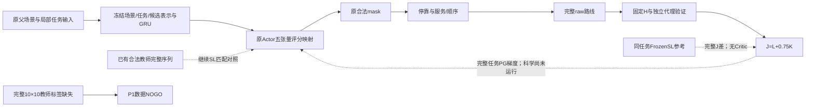

# 已实现机制及科学边界

```mermaid
flowchart LR
  I[原父场景与局部任务输入] --> F[冻结场景/任务/候选表示与GRU]
  F --> S[原Actor五张量评分映射]
  S --> M[原合法mask]
  M --> A[停靠与服务/顺序]
  A --> R[完整raw路线]
  R --> H[固定H与独立代理验证]
  H --> J[J=L+0.75K]
  J -.完整任务PG梯度；科学尚未运行.-> S
  SL[同任务FrozenSL参考] -.完整J差；无Critic.-> J
  L[已有合法教师完整序列] -.继续SL匹配对照.-> S
  B[完整10×10教师标签缺失] --> X[P1数据NOGO]
```

工程阶段已验证原评分图连通、冻结参数、完整回报及导出。正式冻结后使用贪心+固定H；导航、双臂服务代理及约束由原规则决定，无真实IK/关节轨迹认证。
